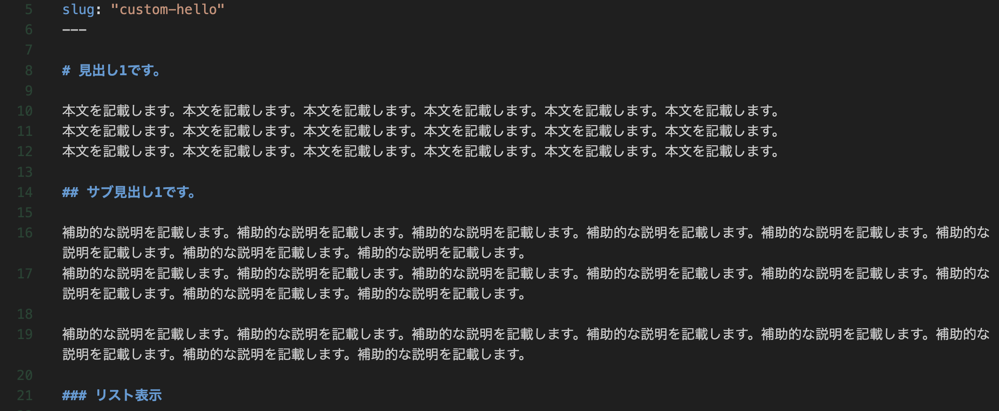

# 見出し1です。

本文を記載します。本文を記載します。本文を記載します。本文を記載します。本文を記載します。本文を記載します。
本文を記載します。本文を記載します。本文を記載します。本文を記載します。本文を記載します。本文を記載します。
本文を記載します。本文を記載します。本文を記載します。本文を記載します。本文を記載します。本文を記載します。

## サブ見出し1です。

補助的な説明を記載します。補助的な説明を記載します。補助的な説明を記載します。補助的な説明を記載します。補助的な説明を記載します。補助的な説明を記載します。補助的な説明を記載します。補助的な説明を記載します。
補助的な説明を記載します。補助的な説明を記載します。補助的な説明を記載します。補助的な説明を記載します。補助的な説明を記載します。補助的な説明を記載します。補助的な説明を記載します。補助的な説明を記載します。

補助的な説明を記載します。補助的な説明を記載します。補助的な説明を記載します。補助的な説明を記載します。補助的な説明を記載します。補助的な説明を記載します。補助的な説明を記載します。補助的な説明を記載します。

### 各コンテンツ

#### リスト表示

- 要素1
- 要素2
- 要素3
- 要素4

#### 画像の挿入



上記に画像を挿入しました。

#### ソースコード

```shell
npx install gatsby-cli
```

```js
const greeting = "hello, from Gatsby."
console.log({ greeting });
```

